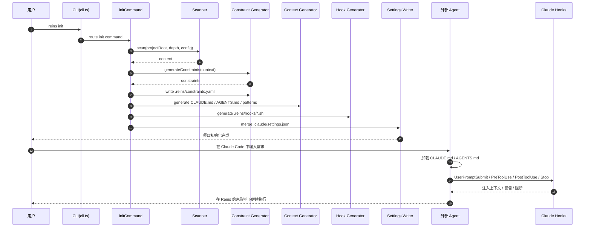

# 用户需求处理时序

## 文档目的

这份文档回答一个具体问题：

**当用户输入一个需求时，Reins 当前版本到底是怎么跑起来的？**

它不描述理想蓝图，而是优先描述**当前代码里的真实运行路径**，并明确区分：

- 已经打通的链路
- 设计上存在但尚未接入主流程的链路
- README/模块设计中的目标流程

---

## 一句话结论

当前 Reins 在“用户输入需求”这件事上，真实生效的方式是：

1. 先通过 `reins init` 扫描项目，生成约束、上下文文件、hook 脚本和 agent 配置
2. 用户随后在 Claude Code / 其他 agent 中直接输入需求
3. Reins 通过 `CLAUDE.md` / `AGENTS.md` / `.reins/patterns/*` 和 `.claude/settings.json` 中注册的 hooks，间接影响 agent 的行为

**当前并不是**由 `reins develop <task>` 真正接管需求并驱动完整开发流水线。

---

## 两条需求处理路径

### 路径 A：设计目标中的理想流程

按模块设计与 README 的目标表达，需求处理流程应当是：

```text
用户输入需求
  -> reins develop <task>
  -> Pipeline Runner 注入约束
  -> ralplan 规划
  -> executor 执行
  -> ralph review / 迭代
  -> QA
  -> Evaluation
  -> 记录日志
  -> learn / update / knowledge 回流
```

对应代码骨架：

- CLI 入口：`src/cli.ts`
- Pipeline Runner：`src/pipeline/runner.ts`
- Constraint Injector：`src/pipeline/constraint-injector.ts`
- Evaluation：`src/evaluation/evaluator.ts`

### 路径 B：当前版本真实可运行流程

当前代码中真正接通的，是一条“**先初始化，再借助外部 agent 执行需求**”的路径：

```text
用户运行 reins init
  -> 扫描项目
  -> 生成 constraints.yaml
  -> 生成 CLAUDE.md / AGENTS.md / patterns
  -> 生成 hooks
  -> 写入 .claude/settings.json

用户在外部 agent 中输入需求
  -> agent 读取上下文文件
  -> Claude hook 在 UserPromptSubmit / PreToolUse / PostToolUse / Stop 阶段触发
  -> Reins 约束以“上下文 + hook 拦截/告警”的方式影响执行
```

这也是当前最重要的现实认知：

**Reins 目前更像一个约束与上下文基础设施层，而不是一个真正接管任务执行的 orchestrator。**

---

## 当前真实时序图

```text
┌──────────────┐
│     用户      │
└──────┬───────┘
       │ 1. reins init
       ▼
┌──────────────────────────┐
│ CLI: src/cli.ts          │
└──────┬───────────────────┘
       │ 路由到 initCommand()
       ▼
┌──────────────────────────┐
│ commands/init.ts         │
└──────┬───────────────────┘
       │ 2. loadConfig()
       │ 3. scan()
       ▼
┌──────────────────────────┐
│ scanner/scan.ts          │
└──────┬───────────────────┘
       │ 输出 context
       ▼
┌──────────────────────────┐
│ constraints/generator.ts │
└──────┬───────────────────┘
       │ 4. 生成 constraints
       │ 5. 写 .reins/constraints.yaml
       ▼
┌──────────────────────────┐
│ context/index.ts         │
└──────┬───────────────────┘
       │ 6. 生成 CLAUDE.md / AGENTS.md / patterns
       ▼
┌──────────────────────────┐
│ hooks/generator.ts       │
└──────┬───────────────────┘
       │ 7. 生成 .reins/hooks/*.sh
       ▼
┌──────────────────────────┐
│ hooks/settings-writer.ts │
└──────┬───────────────────┘
       │ 8. 合并写入 .claude/settings.json
       ▼
┌──────────────┐
│   外部 agent  │
└──────┬───────┘
       │ 9. 用户直接输入需求
       │ 10. agent 加载 CLAUDE.md / AGENTS.md
       │ 11. Claude hooks 触发
       ▼
┌──────────────────────────┐
│ Hook / Context Influence │
└──────────────────────────┘
```

### Mermaid 版本



---

## 分阶段展开

## 1. 初始化阶段：把“项目规则”准备好

入口：`src/commands/init.ts`

核心步骤：

1. `loadConfig(projectRoot)` 读取 `.reins/config.yaml` 及默认配置
2. `scan(projectRoot, depth, config)` 扫描目录、技术栈、测试框架、规则特征
3. `generateConstraints(context, projectRoot)` 从扫描结果推断约束
4. `writeConstraintsFile()` 写 `.reins/constraints.yaml`
5. `generateContext()` 生成三层上下文
6. `runAdapters()` 输出多格式 agent 配置文件

关键代码位置：

- `src/commands/init.ts:16`
- `src/scanner/scan.ts`
- `src/context/index.ts:26`

这个阶段的本质是：

**把隐含在项目里的协作规则，翻译成 agent 可消费的静态上下文和可执行约束。**

---

## 2. 上下文生成阶段：把约束变成 agent 能读懂的内容

入口：`src/context/index.ts`

Reins 生成三层上下文：

- L0：项目根目录 `CLAUDE.md`
- L1：目录级 `AGENTS.md`
- L2：`.reins/patterns/*.md`

它们的作用不是“执行需求”，而是：

- 在 agent 开始任务前给它项目地图
- 在进入具体目录时提供局部约束
- 在需要时提供更细的模式参考

换句话说，用户之后输入需求时，agent 优先接触到的是这些文件，而不是 Pipeline Runner。

---

## 3. Hook 注册阶段：把约束接到 agent 事件点上

入口：

- `src/hooks/generator.ts`
- `src/hooks/settings-writer.ts`

这一阶段做两件事：

1. 为可执行约束生成 shell hook 脚本，放到 `.reins/hooks/`
2. 把这些 hook 注册进 `.claude/settings.json`

当前映射关系：

- `post_edit` -> `PostToolUse`
- `pre_bash` -> `PreToolUse`
- `pre_complete` -> `Stop`
- `context_inject` -> `UserPromptSubmit`

对应代码：`src/hooks/settings-writer.ts:35`

这意味着 Reins 的介入点是 Claude Code 的生命周期事件，而不是 Reins 自己维护的一套对话循环。

---

## 4. 用户真正输入需求时：当前发生了什么

当项目已经 `reins init` 过，用户在 Claude Code 中输入类似：

```text
帮我加一个登录功能
```

当前真实流程是：

1. Claude Code 启动任务
2. 预加载根目录 `CLAUDE.md`
3. 如果进入某个子目录，再加载对应 `AGENTS.md`
4. 如果配置了 `UserPromptSubmit` hook，则在需求提交时触发 Reins 的 `context_inject`
5. 当 agent 准备执行 Bash 时，触发 `PreToolUse` hook
6. 当 agent 修改文件后，触发 `PostToolUse` hook
7. 当 agent 准备结束时，触发 `Stop` hook

因此当前用户需求不是进入 `runPipeline()`，而是进入：

**外部 agent 的正常工作流 + Reins 约束层的旁路拦截与上下文注入。**

---

## 5. Pipeline Runner 目前处于什么状态

入口：`src/pipeline/runner.ts`

代码里的流水线阶段已经定义出来：

1. `harnessInit`
2. `ralplan`
3. `execution`
4. `ralph`
5. `qa`

但它当前有两个关键事实：

### 5.1 CLI 主链路没有接进去

`reins develop <task>` 在 CLI 里仍然只是：

```ts
console.log(`reins develop — not yet implemented (task: ${task})`)
```

位置：`src/cli.ts:29`

也就是说，用户如果直接通过 Reins 输入一个需求，并不会进入 `runPipeline()`。

### 5.2 底层 bridge 还是 stub

`src/pipeline/omc-bridge.ts` 当前实现：

- `ralplan()`：返回空 plan
- `executor()`：返回 `success: true` 和 `output: 'stub'`
- `ralph()`：返回 `success: true`

所以就算手动调用 pipeline，它现在也更接近“流程骨架验证”而不是“真实开发执行”。

---

## 6. Evaluation 在当前需求流里的位置

入口：`src/evaluation/evaluator.ts`

Evaluation 目前可以做：

- L0 静态检查
- L1 coverage gate
- 有条件地跑 L2 / L3 / L4

但它的触发依赖 Pipeline Runner 的 `ralph` 阶段。

由于当前 `develop` 没接通，所以在“用户输入需求”的主路径里，Evaluation 不是默认自动发生的，而更像是为未来 `develop` 流水线准备好的校验层。

---

## 7. Knowledge System 在这条链路里的真实作用

当前与“用户输入需求”最接近的知识注入能力，不在 Pipeline Runner，而在 hook 体系周边。

例如 `src/knowledge/injector.ts` 会把相关知识条目格式化成一段注入文本：

```text
[Reins Knowledge] 2 relevant experience(s) for this task:
1. [gotcha] ...
2. [decision] ...
```

这说明未来的目标是：

- 用户输入需求
- hook 检索相关 knowledge
- 在 prompt 提交前注入简短经验摘要

但从当前代码看，这条线更接近“局部能力已准备”，还没有形成一个完全闭环、统一对外暴露的需求处理主流程。

---

## 当前系统的本质定位

结合现状，当前系统更准确的定位应当是：

### 现在已经成立的定位

Reins 是一个：

- 项目约束提取器
- agent 上下文生成器
- Claude hook 配置器
- 约束执行辅助层

### 还没有完全成立的定位

Reins 还不是一个：

- 端到端任务编排器
- 接收用户需求后自动规划、执行、复审、验证的完整 runtime

---

## 当前链路的主要断点

### 断点 1：`develop` 没有接入真实 pipeline

用户从 CLI 输入需求时，没有进入 `runPipeline()`。

### 断点 2：OMC bridge 还是 stub

即使 pipeline 被接通，也还没有真实 agent 执行能力。

### 断点 3：真实主路径依赖外部 agent

当前“需求执行”依赖 Claude Code 自己的运行循环，Reins 只能通过上下文和 hooks 影响它。

### 断点 4：README 的产品叙事领先于实际可运行链路

文档里把 `develop` 作为核心路径，但代码里主路径仍是 `init -> 外部 agent + hooks`。

---

## 推荐的理解方式

如果今天要向团队解释“用户输入一个需求后，系统怎么跑”，最准确的说法应该是：

```text
当前版本：
  用户需求 -> 外部 agent
           -> Reins 生成的上下文文件被读取
           -> Reins 注册的 hooks 在关键事件点执行
           -> 约束以注入 / 警告 / 阻断的方式生效

目标版本：
  用户需求 -> reins develop
           -> Pipeline Runner
           -> plan / execute / review / QA / evaluate
           -> knowledge / update 闭环
```

---

## 相关代码索引

### 入口与初始化

- `src/cli.ts`
- `src/commands/init.ts`

### 上下文与约束

- `src/scanner/scan.ts`
- `src/constraints/generator.ts`
- `src/context/index.ts`

### Hook 与 agent 接入

- `src/hooks/generator.ts`
- `src/hooks/settings-writer.ts`

### 未来需求主流程

- `src/pipeline/runner.ts`
- `src/pipeline/constraint-injector.ts`
- `src/pipeline/omc-bridge.ts`

### 验证与知识

- `src/evaluation/evaluator.ts`
- `src/knowledge/injector.ts`

---

## 最终结论

当前 Reins 对“用户输入需求”的处理，已经完成了**约束准备层**和**agent 注入层**，但尚未完成**任务执行编排层**。

因此，当前最真实的系统时序不是：

```text
需求 -> Reins develop -> 自动开发完成
```

而是：

```text
需求 -> 外部 agent
     -> Reins 提供上下文与 hooks
     -> 影响 agent 的执行过程
```

这是理解当前项目阶段和后续演进方向的关键。
